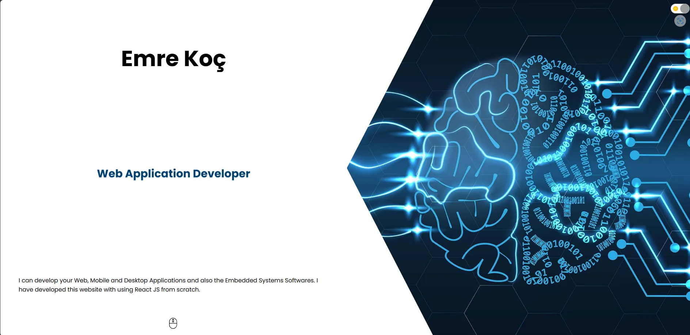

# 💼 My Portfolio Site

This is a basic **React-based personal portfolio website** I created when I first started learning React. The goal was to build a clean, responsive, and modern-looking site to showcase my projects and briefly introduce myself as a developer.

> 🔰 This project reflects my early steps into the world of React and front-end development.

## 🚀 Live Demo

👉 You can check the live version here (if deployed):  
[🔗 Demo Link](https://kochemre.github.io/my-portfolio-site/)  

---

## 📸 Screenshots



---

## 🛠️ Features

- Built with **React.js**
- **Responsive design** for mobile and desktop
- Simple and clean UI
- Sections for:
  - About Me
  - Projects
  - Contact Info
- Fully functional navigation
- Organized component structure

---

## 🧰 Tech Stack

- **React**  
- **CSS3**
- **HTML5**

---

## 📦 Installation

To run the project locally:

```bash
git clone https://github.com/KochEmre/my-portfolio-site.git
cd my-portfolio-site
npm install
npm start

